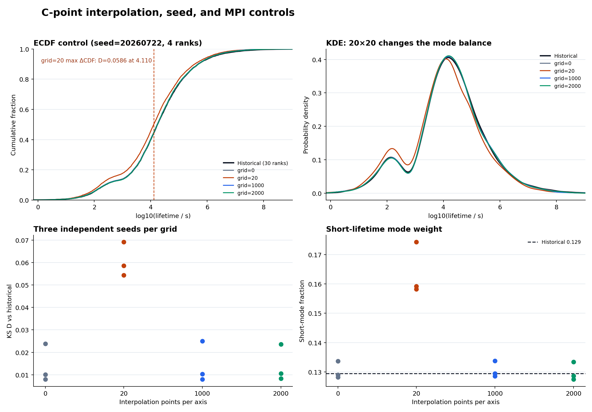
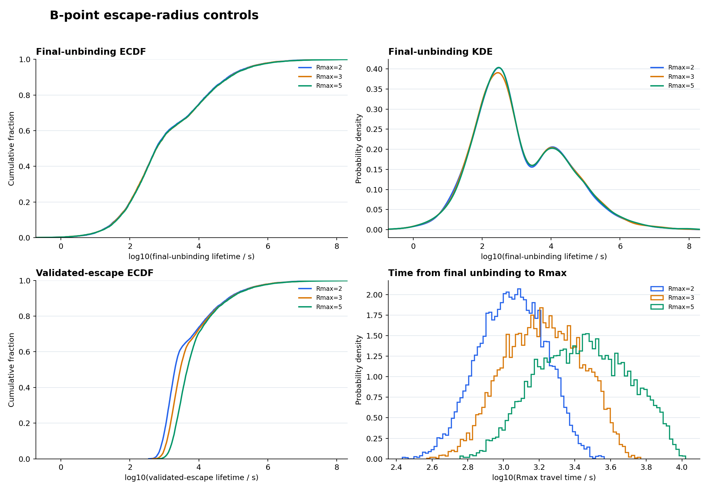

# 蒸发时间次峰：C 点网格/MPI 控制与 B 点边界重放报告

日期：2026-07-22

分支：`codex/evap-secondary-trajectory-diagnostics-test`

最终可执行代码提交：`ee98997fd2ef59951be6e3a4b00f792d0d63eeed`

## 结论

本轮控制实验通过。C 点原有 `KS D≈0.058` 的系统偏移可由 `20×20` 散射率插值网格解释：禁用插值以及 `1000×1000`、`2000×2000` 网格均恢复到与历史分布相容的模式权重和 KS 范围。4-rank 与历史 30-rank 规模的同 seed 对照也相容。因而不触发“RK 容差收紧 10 倍、最大步长减半”分支。

B 点的最终解绑定双峰对 `Rmax=2/3/5 Rsun` 稳定；验证逃逸寿命随 Rmax 增加而右移，说明边界主要改变最终解绑定后的传播尾段，而没有消除双峰。短峰/谷区/长峰的事件重放继续支持“长寿命支更常经历太阳外 bound 轨道时间尺度”的描述性解释，但仍不足以给出唯一物理成因。

最终分类保持：**双峰可信；C 点首轮偏移是粗插值网格造成的数值可比性问题；B 点支持外部 bound 轨道时间尺度的描述性解释；物理成因仍为证据不足。**

## 冻结版本与可复现性

首个完整诊断基线提交为：

- commit：`d084214d242b19a5d217e16f6b121cd6a547a86e`
- 该提交的 binary patch SHA-256：`84c0a73b75467b7020722e9f162576f08f771c403f05716a13258228f4e56652`

最终控制可执行代码提交为：

- commit：`ee98997fd2ef59951be6e3a4b00f792d0d63eeed`
- 从原始 `71f701125dbeffbc2935b12bbb5a05bacbf2d4ed` 到该可执行提交的 binary patch SHA-256：`50d86e959c6a2919a982b36ef9a25cc7f0a537d106bae7a1ac33fd6d69979b5e`
- `ee98997` 单提交 binary patch SHA-256：`c360532ec6a341086d6bac14e41ece4d4826046c946ae3142bde564317e30f52`

C 控制输出记录 `git_commit=d084214, git_dirty=false`；最终 B 控制输出记录 `git_commit=ee98997, git_dirty=false`。分析 manifest 保存了所有输入寿命文件的 SHA-256。原始大体积运行目录未纳入 Git，配置、运行器、统计表、图片和筛选后的事件/RNG 重放状态已纳入版本控制。

## C 点：20×20 网格是主要偏移源

固定参数为 `mχ=0.01 GeV`、`σ=1e-36 cm²`、4 ranks、每组目标 10,000 captured；每个网格使用 `20260722/23/24` 三个独立 seed。峰位和权重均使用最终解绑定寿命。

| 每轴插值点 | seed 数 | 平均完成事件 | KS D 均值（范围） | 短峰权重均值（范围） | 峰位均值 | 完成事件平均散射数 | 数值失败率均值 |
|---:|---:|---:|---:|---:|---|---:|---:|
| 0 | 3 | 9,964.7 | 0.0140（0.0079–0.0239） | 0.1303（0.1282–0.1337） | 2.179; 4.176 | 3.825 | `6.91e-4` |
| 20 | 3 | 9,991.3 | 0.0607（0.0544–0.0691） | 0.1639（0.1583–0.1743） | 2.176; 4.052 | 3.932 | `7.08e-4` |
| 1000 | 3 | 9,966.3 | 0.0144（0.0079–0.0250） | 0.1306（0.1285–0.1337） | 2.189; 4.153 | 3.828 | `6.38e-4` |
| 2000 | 3 | 9,975.7 | 0.0142（0.0083–0.0236） | 0.1298（0.1274–0.1334） | 2.220; 4.139 | 3.829 | `6.32e-4` |

历史样本短峰权重为 0.12945。20×20 的三个 seed 均把短峰权重提高约 0.03–0.045，并在 `log10(t/s)≈3.87–4.11` 产生最大 CDF 差异。同 seed 的 20×20 与 1000×1000 直接比较得到：

| seed | KS D | p-value | 最大差异位置 `log10(t/s)` |
|---:|---:|---:|---:|
| 20260722 | 0.0561 | `4.23e-14` | 3.987 |
| 20260723 | 0.0577 | `6.78e-15` | 3.863 |
| 20260724 | 0.0511 | `8.99e-12` | 4.163 |

数值失败率在四种网格间同阶，且 20×20 并不因更多失败而特殊。因此 C 点偏移不能用少量失败记录的直接缺失解释；它来自粗网格改变了传播统计。

### MPI/RNG 对照

`grid=1000, seed=20260722` 的 4-rank 与 30-rank 分布直接比较得到 `KS D=0.00817, p=0.889`。30-rank 样本对历史文件为 `D=0.00841, p=0.865`。在本次单 seed 对照中，没有检测到 MPI 数量导致的分布偏移；但这不等于不同 MPI 数量共享相同随机流，metadata 仍明确记录 rank 派生 seed。

### 为什么未运行 RK 收紧分支

1000/2000 网格的三 seed 模式权重恢复到历史值，KS D 均值约 0.014，原来的稳定 `D≈0.058` 不再存在。1000 网格的 seed 20260723 单独为 `D=0.0250, p=0.0037`，但其余 seed 和 2000 网格未呈现同方向系统偏移；这属于需要保留的 seed 间尾部波动，而不是触发整套 RK 分支的稳定偏移。

99% 分位相对 10k 历史参考仍有约 −0.21 至 −0.23 dex 的平均差异。它对 KS 主体影响很小，但在研究极端长尾时应使用更多独立 seed 或更大参考样本。

## 27 条 C 点能量漂移失败已精确重放

原 C 输出的 27 条 `energy_drift_escape` 均未被 2% trace 选中。使用相同 `seed=20260722`、20×20 网格和 4 ranks，将目标样本略增并设置 `trace_rate=1` 后：

- 27/27 的 `(rank, trajectory_id)` 被重新覆盖；
- 27/27 的终止原因相同；
- 27/27 的 `max_scaled_ballistic_energy_drift` 文本值完全相同；
- 27/27 保存了 `Initial_Conditions` 前和正式传播前的完整 MT19937 状态；
- 失败与成功对照子集共保留 11,667 行实时事件。

失败 censor duration 多位于成功寿命分布的极端长尾。按“不重复成功轨迹、log-duration 最近邻”匹配时，仅 7/27 可落在 ±0.25 dex，最大差异 2.42 dex。因此这些成功轨迹只能作为近似长尾对照，不能把 censor duration 当作失败轨迹的真实寿命。失败样本的 censor duration 是下界。

该事实也说明：27 条失败值得继续研究其数值机制，但它们的直接缺失比例不足以造成原 `D≈0.058` 的整体 CDF 偏移。

## B 点：Rmax=2/3/5 控制

固定参数为 `mχ=0.01 GeV`、`σ=1e-34 cm²`、1000×1000 网格、`seed=20260722`、4 ranks、每组目标 10,000 captured、10% 稳定 trace。最终输出均来自干净提交 `ee98997`。

| Rmax [Rsun] | 完成事件 | captured 无效 | 最终解绑定峰位 | 短/长权重 | 对 R2 的 KS D | 完成事件平均散射数 | 数值失败率 |
|---:|---:|---:|---|---|---:|---:|---:|
| 2 | 9,996 | 5 | 2.486; 4.037 | 0.649; 0.351 | 0 | 44.85 | `6.96e-4` |
| 3 | 10,088 | 4 | 2.547; 4.000 | 0.638; 0.362 | 0.00864 | 46.92 | `6.53e-4` |
| 5 | 10,113 | 3 | 2.562; 3.980 | 0.649; 0.351 | 0.00745 | 45.62 | `6.79e-4` |

三组最终解绑定分布相容，且双峰均保留。最终解绑定到 Rmax 的传播时间中位数为 1,119/1,671/2,800 秒，90% 分位为 1,918/3,218/6,134 秒。验证逃逸寿命的短端因此随边界显著右移，而长寿命端相对变化很小。

### 控制实验发现并修复了一个 ULP 边界缺陷

首次 Rmax 控制中，R2 有 1 条、R5 有 37 条完成事件越过配置边界。根因是：三维交点已求根并径向投影，但重新求位置向量的模可能比 Rmax 小一个浮点 ULP；随后严格的 `r_boundary >= maximum_distance` 判断绕过了 escape 分支。

修复后，逻辑半径直接采用已经求解的目标 `maximum_distance`。最终三组：

- `escape_radius_invariant=true`；
- 所有 metadata 不变量均为 true；
- 最大 `abs(r_escape-Rmax)` 为 `8.88e-16/8.88e-16/2.66e-15 Rsun`；
- 完整 CTest（含 2/3/4-rank MPI）17/17 通过。

此前带越界记录的 B 控制输出已被最终干净提交结果替换，不应使用。

## B 点短峰/谷区/长峰分层重放

分层中心由 R2 的同一峰检测规则给出：短峰 2.486、谷区 3.440、长峰 4.037。短/长峰取 ±0.25 dex，谷区取 ±0.18 dex；从固定 10% trace 中按距中心最近选择，保留完整初始条件、两份 MT19937 状态和实时事件。

| 分层 | 全部候选 | traced 候选 | 重放子集 | capture 半径中位数 [Rsun] | capture 能量中位数 [eV] | 太阳外驻留占比中位数 | 至少一次 recapture |
|---|---:|---:|---:|---:|---:|---:|---:|
| 短峰 | 2,087 | 224 | 100 | 0.504 | −8.62 | 0.379 | 0.34 |
| 谷区 | 496 | 50 | 50 | 0.503 | −18.66 | 0.107 | 0.44 |
| 长峰 | 1,054 | 110 | 100 | 0.588 | −10.34 | 0.748 | 0.28 |

长峰的太阳外驻留占比显著高于短峰，且 capture 半径更大；谷区反而更深地束缚、太阳外占比最低、recapture 比例最高。这不支持“仅由 recapture 次数决定双峰”的简单模型，更符合外部 bound 轨道时间尺度参与塑造长寿命支的描述性图景。

这些是条件相关性，不是因果分解。要形成物理定论，仍需把事件序列归约成可检验的动力学状态变量，并在独立 seed 上复核。

## 可复核产物

- C 每 run 指标：`analysis/c_control_summary/run_metrics.csv`
- C 网格汇总：`analysis/c_control_summary/grid_summary.csv`
- C 分位数：`analysis/c_control_summary/grid_quantile_summary.csv`
- C 同 seed/MPI 对照：`analysis/c_control_summary/pairwise_controls.csv`
- C 失败重放：`analysis/c_failure_replays/`
- B Rmax 指标：`analysis/b_rmax_controls/rmax_metrics.csv`
- B Rmax 分位数：`analysis/b_rmax_controls/rmax_quantiles.csv`
- B 分层汇总：`analysis/b_rmax_controls/strata_summary.csv`
- B 分层 RNG/初始状态：`analysis/b_rmax_controls/stratified_replays.tsv`
- B 分层事件：`analysis/b_rmax_controls/stratified_events.tsv`
- 运行器与分析脚本：`scripts/diagnostics/`

## 最终审阅建议

可以把 C 点数值可比性问题视为已解决，并把 `interpolation_points=1000` 作为后续生产基线；20×20 结果只保留为粗网格反例。当前不需要为所有粒子输出逐积分步轨迹。

物理结论仍应保持克制：**双峰稳定；B 点的外部 bound 轨道时间尺度解释得到更强描述性支持；能量漂移失败和极端长尾仍需专门数值研究；次峰唯一成因尚未确定。**
